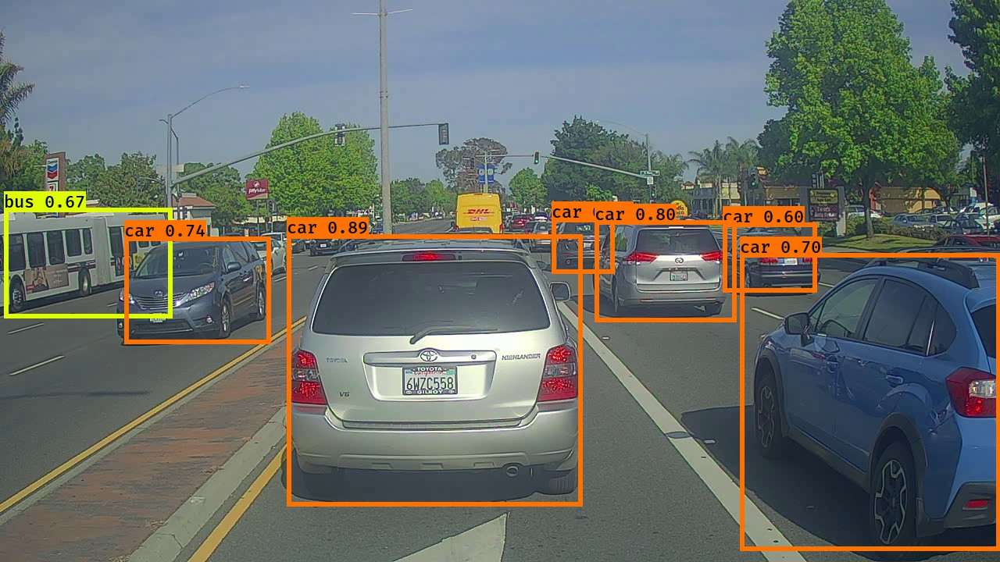

# YOLO2 Object Detection (Keras )

This repository presents a quick and simple implementation of YOLOv2 object detection using Keras library with Tensorflow backend.


## Some example applications :



<iframe height=498 width=510 src="out/test_video.mp4" frameborder=0 allowfullscreen></iframe>

<video src="out/test_video.mp4" width="320" height="240" controls="controls">
</video>

## Thoughts on the implementation

YOLO is well known technique used to perform fast multiple localizations on a single image.  

- Divide the image using a grid (eg: 19x19).
   Dividing the image into a grid of smaller images increases the possibilities of object detection inside each cell easier.
- Perform image classification and Localization on each grid cell.
   a vector for each cell representing the probability of an object detected, the dimensions of the bounding box and class of the detected image.
- Perform thresholding to remove multiple detected instances .
  Thresholding picks the cells with the highest probabilities so that the more correcet bounding boxes are selected
- Perform Non-max suppression to refine the boxes more.
  The technique of non-max suppression offers a convenient way to refine the results more using a calculation know as Intersection of Union
- Additionally anchor boxes are used to detect several objects in one grid cell.
  This is a specialty in the Yolo V2 algorithm compared to the others.

#### YOLO9000
**Paper reference**: [YOLO9000: Better, Faster, Stronger](https://arxiv.org/abs/1612.08242) by Joseph Redmond and Ali Farhadi.


## Quick Start

- Download  Darknet model cfg and weights from the [official YOLO website](http://pjreddie.com/darknet/yolo/). 

- Convert the Darknet YOLO_v2 model to a Keras model

- Copy the generated h5 file to the model_data folder.

- Place the input image  in the images folder ,and place the video  in the videos folder.

- run  yolo2_detect_image

  ​


## More Details

How to convert cfg and weights files to h5 using YAD2k library 

- Clone the [YAD2K Library](https://github.com/allanzelener/YAD2K) to your PC
- Open terminal from the cloned directory
- Downloaded weights and cfg files to the YAD2K master directory
```
wget http://pjreddie.com/media/files/yolo.weights
wgethttps://raw.githubusercontent.com/pjreddie/darknet/master/cfg/yolo.cfg
```
- Run `python yad2k.py yolo.cfg yolo.weights model_data/yolo.h5` on the terminal and the h5 file will be generated.
- Move the  yolo.h5 file to model_data folder 

# yolo2_keras
